For a while, I’ve been meaning to step away from proprietary music streaming services like Spotify and Apple Music. Having already used Jellyfin to stream movies and TV shows across my home network, self-hosting my music seemed like the logical next step.

I had a spare ThinkPad laptop lying around that I wasn't using much, so I hosted **Navidrome** on it using CasaOS and paired it with the **Symfonium** app on my phone to stream music anywhere. For grabbing tracks, I found an awesome app called **Downtify**, which leverages `yt-dlp` to download songs along with their artwork.

While this setup handled playback and storage effortlessly, one major problem remained: **the recommendation system**. The main thing that kept me returning to commercial streaming services was algorithmic discovery like Spotify's *Discover Weekly*. Without it, discovering new music and keeping a self-hosted library fresh meant manually searching for, vetting, and downloading tracks one by one.

To bridge that gap, I built **Hera**—a self-hosted music recommendation system and automated downloading service.

---

## What is Hera?

Hera connects your listening habits to your local media server. It integrates with the [Last.fm API](https://www.last.fm/api/authentication) to analyze your music tastes, derive tailored recommendations, and automatically download them into your local library through Downtify on a configurable schedule.

With Hera running in the background, it can wake up every night, discover new tracks matching what you've been listening to, and pull them into your library without requiring any manual effort.

### Key Features

- **Last.fm-Powered Recommendations:** Discovers tracks based on your recent scrobbles, top artists, and musical tags/genres.
- **Automated Scheduling:** Configurable cron job to automatically run discovery and download batches (e.g., pulling 10 new tracks every night).
- **Library Guard (Deduplication):** Actively inspects your mounted media storage and download history so you never re-download tracks you already own.
- **Audit History:** Maintains a clear log of downloaded, skipped, and failed tracks.
- **Manual Grabber & Search:** Allows searching for specific songs or artists, or pasting Spotify/YouTube Music links to download on demand.
- **Live Web Dashboard:** A responsive UI with WebSocket support for streaming live download progress and backend worker activity.

---

## System Architecture

I built Hera with **Java and Spring Boot**, organizing the workflow into distinct layers for orchestration, recommendation strategy, library inspection, and download execution.

```mermaid
flowchart TD

subgraph group_api["Dashboard & API"]
  node_ui["Static dashboard<br/>browser UI<br/>[index.html]"]
  node_controller["Music controller<br/>Spring REST API"]
  node_errors["API error handler<br/>exception boundary"]
  node_websocket["WebSocket endpoints<br/>live activity API"]
end

subgraph group_core["Recommendation & Downloads"]
  node_recommendations["Recommendation service<br/>recommendation pipeline"]
  node_strategy_provider["Strategy provider<br/>recommendation mode selector"]
  node_hybrid_strategy["Hybrid strategy<br/>recommendation strategy"]
  node_orchestrator["Orchestrator service<br/>scheduled download workflow"]
  node_downloads["Download service<br/>download executor"]
  node_deduplication["Deduplication service<br/>library guard"]
  node_cleanup["Format cleanup service<br/>post-download conversion"]
end

subgraph group_integrations["External Services & Storage"]
  node_settings["Settings service<br/>settings persistence"]
  node_app_settings["App settings<br/>settings model<br/>[AppSettings.java]"]
  node_history[("History service<br/>audit history")]
  node_lastfm{{"Last.fm client<br/>recommendation API adapter<br/>[LastFmClient.java]"}}
  node_downtify{{"Downtify client<br/>download backend adapter"}}
  node_music_library[("Shared music library<br/>mounted media storage")]
end

subgraph group_runtime["Runtime & Deployment"]
  node_application["Hera application<br/>Spring bootstrap"]
  node_deployment["Container composition<br/>Docker deployment<br/>[docker-compose.yml]"]
  node_runtime_config["Spring runtime config<br/>environment configuration<br/>[application.yml]"]
end

node_ui -->|"HTTP requests"| node_controller
node_ui -->|"live updates"| node_websocket
node_controller -.->|"API failures"| node_errors
node_controller -->|"recommend"| node_recommendations
node_controller -->|"search and download"| node_downloads
node_controller -->|"manage settings"| node_settings
node_controller -->|"activity queries"| node_history
node_recommendations -->|"select mode"| node_strategy_provider
node_strategy_provider -->|"hybrid mode"| node_hybrid_strategy
node_hybrid_strategy -->|"recommendation inputs"| node_lastfm
node_orchestrator -->|"derive candidates"| node_recommendations
node_orchestrator -->|"exclude existing"| node_deduplication
node_orchestrator -->|"submit accepted tracks"| node_downloads
node_orchestrator -->|"record outcomes"| node_history
node_downloads -->|"delegate downloads"| node_downtify
node_downloads -->|"post-process"| node_cleanup
node_deduplication -->|"inspect local media"| node_music_library
node_cleanup -->|"write cleaned media"| node_music_library
node_settings -->|"persist"| node_app_settings
node_websocket -->|"progress and backend activity"| node_ui
node_application -->|"boots"| node_controller
node_runtime_config -->|"configures"| node_application
node_deployment -->|"runs Hera"| node_application
node_deployment -->|"runs backend"| node_downtify
node_deployment -->|"mounts shared directory"| node_music_library

click node_ui "https://github.com/athuull/hera/blob/main/src/main/resources/static/index.html"
click node_controller "https://github.com/athuull/hera/blob/main/src/main/java/com/athuull/hera/controller/MusicController.java"
click node_errors "https://github.com/athuull/hera/blob/main/src/main/java/com/athuull/hera/controller/GlobalExceptionHandler.java"
click node_websocket "https://github.com/athuull/hera/blob/main/src/main/java/com/athuull/hera/ws/WebSocketConfig.java"
click node_recommendations "https://github.com/athuull/hera/blob/main/src/main/java/com/athuull/hera/service/RecommendationService.java"
click node_strategy_provider "https://github.com/athuull/hera/blob/main/src/main/java/com/athuull/hera/service/strategy/RecommendationStrategyProvider.java"
click node_hybrid_strategy "https://github.com/athuull/hera/blob/main/src/main/java/com/athuull/hera/service/strategy/HybridStrategy.java"
click node_orchestrator "https://github.com/athuull/hera/blob/main/src/main/java/com/athuull/hera/service/OrchestratorService.java"
click node_deduplication "https://github.com/athuull/hera/blob/main/src/main/java/com/athuull/hera/service/DeduplicationService.java"
click node_cleanup "https://github.com/athuull/hera/blob/main/src/main/java/com/athuull/hera/service/FormatCleanupService.java"
click node_settings "https://github.com/athuull/hera/blob/main/src/main/java/com/athuull/hera/service/SettingsService.java"
click node_app_settings "https://github.com/athuull/hera/blob/main/src/main/java/com/athuull/hera/model/AppSettings.java"
click node_history "https://github.com/athuull/hera/blob/main/src/main/java/com/athuull/hera/service/HistoryService.java"
click node_lastfm "https://github.com/athuull/hera/blob/main/src/main/java/com/athuull/hera/client/LastFmClient.java"
click node_downtify "https://github.com/athuull/hera/blob/main/src/main/java/com/athuull/hera/client/DowntifyClient.java"
click node_application "https://github.com/athuull/hera/blob/main/src/main/java/com/athuull/hera/HeraApplication.java"
click node_deployment "https://github.com/athuull/hera/blob/main/docker-compose.yml"
click node_runtime_config "https://github.com/athuull/hera/blob/main/src/main/resources/application.yml"

classDef toneNeutral fill:#f8fafc,stroke:#334155,stroke-width:1.5px,color:#0f172a
classDef toneBlue fill:#dbeafe,stroke:#2563eb,stroke-width:1.5px,color:#172554
classDef toneAmber fill:#fef3c7,stroke:#d97706,stroke-width:1.5px,color:#78350f
classDef toneMint fill:#dcfce7,stroke:#16a34a,stroke-width:1.5px,color:#14532d
classDef toneRose fill:#ffe4e6,stroke:#e11d48,stroke-width:1.5px,color:#881337
classDef toneIndigo fill:#e0e7ff,stroke:#4f46e5,stroke-width:1.5px,color:#312e81
classDef toneTeal fill:#ccfbf1,stroke:#0f766e,stroke-width:1.5px,color:#134e4a
class node_ui,node_controller,node_errors,node_websocket toneBlue
class node_recommendations,node_strategy_provider,node_hybrid_strategy,node_orchestrator,node_downloads,node_deduplication,node_cleanup toneAmber
class node_settings,node_app_settings,node_history,node_lastfm,node_downtify,node_music_library toneMint
class node_application,node_deployment,node_runtime_config toneRose
```



### 1. Recommendation Pipeline & Strategy Provider
Hera talks to Last.fm through an API adapter (`LastFmClient.java`). The recommendation pipeline uses a strategy pattern to derive candidate tracks. Under the **Hybrid Strategy**, it balances finding deep cuts from artists you already listen to against branching out into related artists and genre tags.

### 2. Library Guard & Deduplication
To prevent bloating your storage with repeated downloads, candidate tracks pass through `DeduplicationService`. It scans the mounted local music directory and checks the history audit log. Any track that already exists in your library or was previously skipped is filtered out.

### 3. Download & Format Post-Processing
Accepted tracks are handed to the `DownloadService`, which delegates the actual fetching to the Downtify backend. After the audio is downloaded, a post-download cleanup service standardizes tags and audio formatting before writing the clean files directly into the shared music directory.

### 4. Real-Time Dashboard
The web UI connects to Spring Boot REST endpoints for configuration and manual downloads, while a **WebSocket** channel streams live progress updates and background task activity in real time.

---

## Deployment with Docker Compose

Hera is fully containerized and designed to sit right next to Downtify and Navidrome in your home server stack.

Here is a sample `docker-compose.yml` to get started:

```yaml
services:
  hera:
    image: athuull/hera:latest
    container_name: hera
    restart: unless-stopped
    ports:
      - "8080:8080"
    environment:
      - SPRING_PROFILES_ACTIVE=prod
      - LASTFM_API_KEY=your_lastfm_api_key
      - LASTFM_USERNAME=your_lastfm_username
      - CRON_SCHEDULE=0 0 2 * * *  # Runs nightly at 2:00 AM
      - DOWNTIFY_API_URL=http://downtify:8000
    volumes:
      - /path/to/music:/music:rw
      - ./config:/app/config
    depends_on:
      - downtify

  downtify:
    image: downtify/downtify:latest
    container_name: downtify
    restart: unless-stopped
    volumes:
      - /path/to/music:/music:rw
```

Once running, navigate to `http://localhost:8080` to configure your Last.fm credentials and recommendation thresholds.

---

## Conclusion

Combining Navidrome, Symfonium, and Downtify gave me full ownership of my music library, and Hera solved the missing piece: intelligent, hands-free music discovery.

I've been running and testing this setup on CasaOS, and Hera is also listed on the Unraid Community Apps. I'm actively working on new features and improvements, and would love to hear feedback or suggestions from anyone running their own music server!

Source code for the app: https://github.com/athuull/hera
